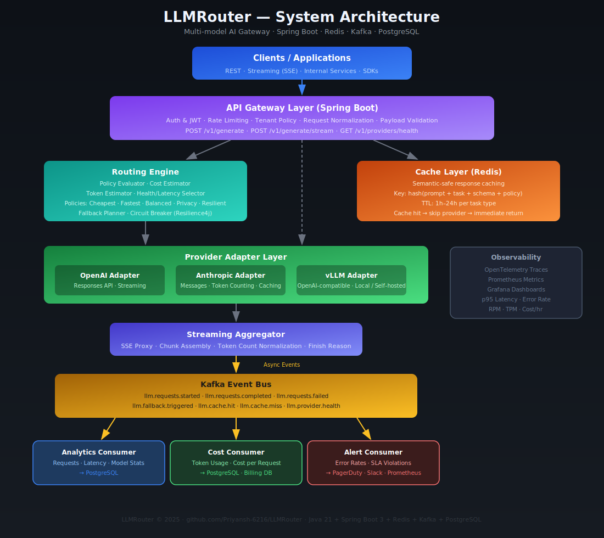

# LLMRouter — Architecture Deep Dive

## Overview

LLMRouter is a production-grade AI inference gateway that decouples client applications from LLM providers. A single unified API handles routing, caching, streaming, fallback, and observability across multiple providers.

---

## System Diagram



---

## Layer Breakdown

### 1. API Gateway Layer (Spring Boot)

The entry point for all requests. Responsibilities:

- **Authentication**: JWT/API key validation per tenant
- **Rate Limiting**: Token bucket per tenant tier
- **Tenant Policy Resolution**: Load tenant's default routing policy
- **Request Normalization**: Map incoming payload to internal `LlmRequest`
- **Response Proxy**: Stream SSE back to client from provider

**Key endpoints:**
| Endpoint | Description |
|---|---|
| `POST /v1/generate` | Unified blocking inference |
| `POST /v1/generate/stream` | SSE streaming inference |
| `GET /v1/providers/health` | Provider health snapshot |
| `GET /v1/models` | Active model catalog |
| `POST /v1/policies/route-preview` | Dry-run route selection |
| `GET /v1/requests/{id}` | Request detail + trace |
| `GET /v1/analytics/usage` | Usage analytics |
| `POST /v1/admin/providers/{p}/disable` | Temporarily disable provider |

---

### 2. Routing Engine

The core brain. Selects which provider/model handles each request.

**Algorithm:**
```
1. Validate request schema
2. Compute cache key (SHA-256)
3. Check Redis — return immediately on hit
4. Estimate token count (Anthropic token-counting API / tiktoken)
5. Filter candidate providers:
   - supports task type?
   - max context ≥ estimated tokens?
   - tenant allowlist?
   - estimated cost ≤ budget constraint?
   - health state = healthy?
6. Score candidates per policy
7. Choose primary provider (highest score)
8. Invoke adapter → on failure: retry / fallback chain
9. Stream or return response
10. Emit Kafka events (async, non-blocking)
11. Optionally write to cache
```

**Policy scoring (Balanced):**
```
score = w_quality × qualityScore
      − w_latency × latencyPenalty
      − w_cost   × costPenalty
      + w_health × healthScore
```

**Supported policies:**
| Policy | Strategy |
|---|---|
| `fastest` | Lowest p95 latency among healthy providers |
| `cheapest` | Lowest cost-per-token that meets constraints |
| `balanced` | Weighted composite score |
| `privacy-first` | Prefer local vLLM for eligible tasks |
| `resilient` | Highest success rate + defined fallback chain |

---

### 3. Provider Adapter Layer

One adapter per provider. Converts the internal `LlmRequest` ↔ provider-specific formats.

**Adapters:**
| Adapter | Transport | Notes |
|---|---|---|
| `OpenAiAdapter` | HTTPS REST | Responses API, streaming |
| `AnthropicAdapter` | HTTPS REST | Messages API, token-counting, prompt caching |
| `VllmAdapter` | HTTPS REST | OpenAI-compatible mode |

Each adapter implements `ProviderClient`:
```java
public interface ProviderClient {
    Mono<LlmResponse>       complete(LlmRequest request);
    Flux<LlmStreamChunk>    stream(LlmRequest request);
    Mono<Integer>           estimateTokens(LlmRequest request);
}
```

---

### 4. Cache Layer (Redis)

Semantic-safe response cache. Prevents redundant LLM calls for identical deterministic prompts.

**Cache key composition:**
```
SHA256(
  normalize(systemPrompt)
  + normalize(userContent)
  + taskType
  + outputSchema
  + temperatureBucket   // rounded to nearest 0.1
  + policyVersion
)
```

**TTL by task type:**
| Task | TTL |
|---|---|
| FAQ / static answers | 24h |
| Document summarization | 1–6h |
| Structured JSON extraction | 6–12h |
| Real-time / personalized | Do NOT cache |

**Do not cache when:**
- Temperature > 0.5 (non-deterministic)
- Prompt contains session-specific timestamps/user state
- Task type is `conversational` or `personalized`

---

### 5. Kafka Event Bus

Decouples synchronous request path from analytics/observability.

**Topics:**
| Topic | Trigger |
|---|---|
| `llm.requests.started` | Request received |
| `llm.requests.completed` | Successful response |
| `llm.requests.failed` | Final failure after retries |
| `llm.fallback.triggered` | Provider switched |
| `llm.cache.hit` | Redis cache served response |
| `llm.cache.miss` | Cache miss, provider called |
| `llm.provider.health` | Health check result |

**Workers:**
- **Analytics Consumer** → write request stats to PostgreSQL
- **Cost Consumer** → aggregate token usage, compute billing
- **Alert Consumer** → SLA violation and error rate alerting

---

### 6. Health Monitor

Continuously tracks provider reliability.

- Collects: error rate, p95 latency, timeout rate, throttle rate
- Temporary disablement on sustained failures
- Circuit breaker via Resilience4j (failure rate + timeout breakers)
- Bulkhead isolation per provider to avoid cascade failures

---

### 7. Streaming Aggregator

Proxies SSE chunks from providers back to clients:
- Reassembles chunks from OpenAI/Anthropic/vLLM stream format
- Normalizes `[DONE]` / `end_turn` / `stop` signals
- Accumulates token counts during stream for usage events

---

## Database Schema

See [`db/migration/`](../llmrouter-api/src/main/resources/db/migration/) for full Flyway migration scripts.

**Key tables:**
- `tenants` — API key, budget, default policy
- `providers` — registered LLM providers
- `models` — model catalog with cost/quality metadata
- `routing_policies` — JSONB-configured scoring policies
- `requests` — per-request log (provider, model, latency, cost)
- `request_attempts` — per-attempt retry/fallback trail
- `provider_health_metrics` — rolling health windows
- `cache_audit` — cache hit/miss audit log

---

## Technology Stack

| Layer | Technology |
|---|---|
| Language | Java 21 (Virtual Threads) |
| Framework | Spring Boot 3.x (WebFlux for streaming) |
| Database | PostgreSQL 16 |
| Cache | Redis 7 |
| Messaging | Apache Kafka 3 |
| Circuit Breaker | Resilience4j |
| Migrations | Flyway |
| Observability | OpenTelemetry + Prometheus + Grafana |
| Containerization | Docker + Docker Compose |
| Build | Maven |
